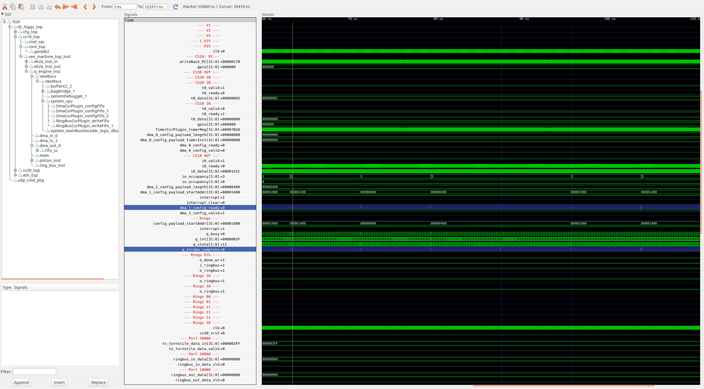

# Test
I found a bug where dma out chunks of size 1024 break after about 10 calls, where as chunks of
2048 do not.

# Instructions
Simply do:
* `make test`

# Structure
cs10 sends data to the "dac" which the test bench picks up and looks at

# Notes
see cs10/main.c and the line which says:
* `#define BROKEN_CHUNK`
* comment this line out to pass the test, by using chunk size 2048

# The problem
something to do with `q_strobe_complete` going high when `q_state` is 3.  Riscv doesn't see the dma strobe under this condition.

* Look at time 87us in this picture

