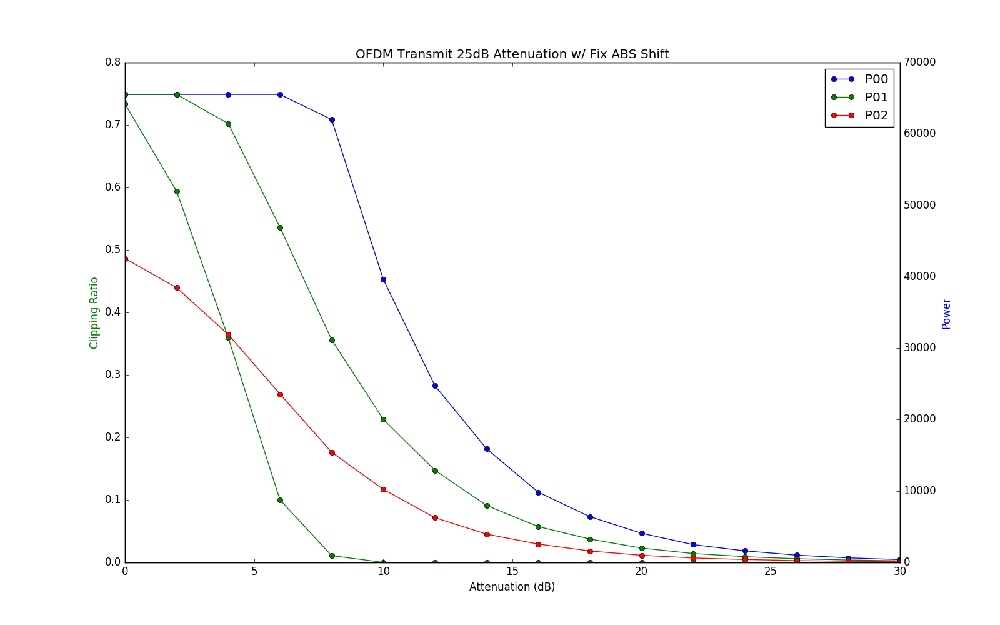
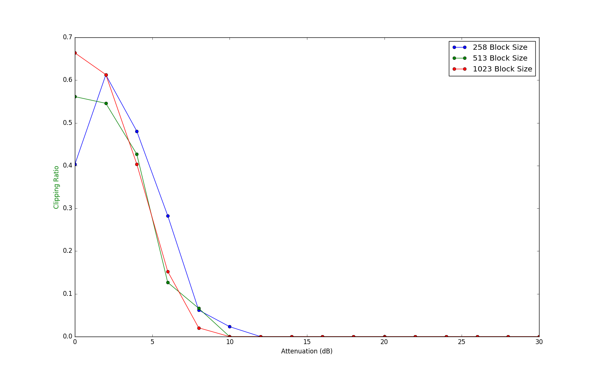

# Test Power Estimation and Automatic Gain Control


The Variable Gain Attenuator (VGA) and Digital Gain Attenuator (DSA) are two attenuators in the ADC used to set attenutation on the receiving chain. When receiving samples, 90% of values (1) must not be clipping and (2) the power of 1024 samples must be within range for OFDM synchronization. This folder test the power estimation and automatic gain control (AGC) algorithm in hardware. The code to test power estimation and automatic gain control can be found via `power_estimation()` and `test_agc()` in `override/fpgas/cs/cs00/c/src/main.c` respectively. As the name of the functions suggest, `power estimation()` determines the power of 1024 samples and `test_agc()` uses that information to determine the optimal attenuation value. The actual functions implemented by `power_estimation()` and `test_agc()` are `get_pwr()` and `auto_gain_ctrl` respectively. In future revisions of Higgs, the VGA will be replaced with a fix gain. As such, the VGA will be set with minimum attenuation when executing the following tests.

# Get Started

## Dependencies

Install the following libraries:

On Ubuntu:
```bash
sudo apt-get install python-pip
sudo pip2 install matplotlib
sudo apt-get install python-tk
```

On openSUSE:
```bash
sudo zypper install python-pip
sudo pip2 install matplotlib
sudo zypper install python-tk
```

Checkout the following branch:
```bash
cd higgs_sdr_rev2
git checkout deng
# Alternatively, master branch works equally well
git checkout master
git submodule update --init --recursive
```

## Testing

### Create Saturation and Power Estimation Graph

To determine the optimal attenuation value, plot a dual axis graph of clipping ratio and power estimation as a function of DSA attenuation. The correct region of operation is where the clipping ratio is below 10% and the estimated power is within range of OFDM synchronization. Illustrated below is an example graph of an OFDM symbol with an input power of -63 dBm.



To create a similar plot with different input signals execute the following steps:

#### Check Board
After flashing, check that your board is correctly operating:

```bash
cd higgs_sdr_rev2
make test_eth
make test_ring
```
Test the health of the RX chain by following instructions in `higgs_sdr_rev2/sim/verilator/test_rx_chain/README.md`.

#### Set VGA
Set the VGA to minimum attenuation with:

```bash
cd higgs_sdr_rev2
make set_vga
```

#### Bootload
Bootload `CS00` with the following commands:

```bash
cd higgs_sdr_rev2/sim/verilator/test_energy
make compilehex
make bootload_cs00
```

#### Transmit Signal
Transmit an OFDM signal with the following commands:

```bash
git clone git@github.com:siglabs/gr-zoo.git
cd gr-zoo/examples
gnuradio-companion again-tx-ofdm-pluto.grc
```
Set `samp_rate` to `125000000/32` and press play

#### Create Graphs

```bash
cd higgs_sdr_rev2
make saturation_map
```

### Create Minimum Block Size Graph

The rational for creating this graph is to determine the minimum block size of data necessary to create saturation graphs. Currently power estimation is performed using 1024 samples. Reducing the block size of samples used to estimate power and clipping ratio reduces latency when setting the optimal gain. Illustrated below is an example graph with an input power of -63 dBm.



To create a similar plot with different input signals execute the following steps:

Following instructions above: `Check Board`, `Set VGA`, `Bootload`, and `Transmit Signal`.

#### Create Graphs

```bash
cd higgs_sdr_rev2
make block_size_map
```   

# Contributing

## Point of Contact
* Janson Fang
* Ben Morse